# Azure App Registration for SharePoint & Microsoft Graph and Group Creation


## 1. Create a New Group

Navigate to **Groups** in the Azure portal, then select **New group** to create a microsoft 365 group for your application.

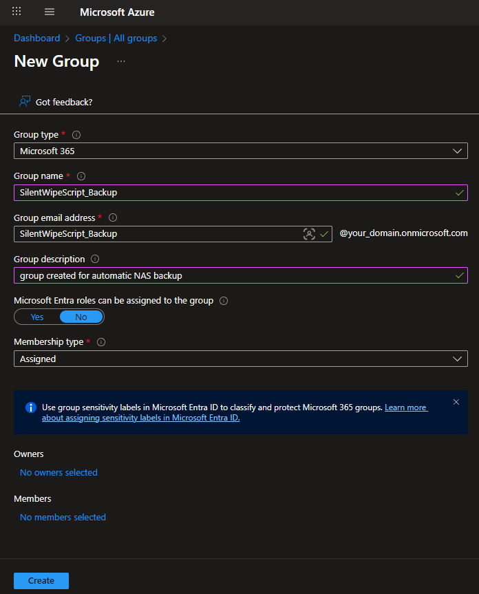


## 2. Create a New App Registration

_App registration is performed in Microsoft Entra ID (formerly Azure AD), available at [portal.azure.com](https://portal.azure.com)._
_Search for "App registrations" in the portal, as all application configuration takes place in Entra ID._

Go to **App registrations** and click **New registration**.

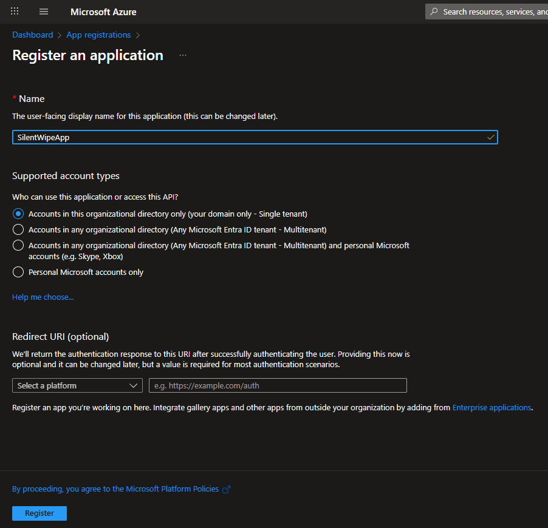

After registration, copy the **Client ID** and **Tenant ID** from the application overview page. These values are required for authentication in PowerShell scripts.

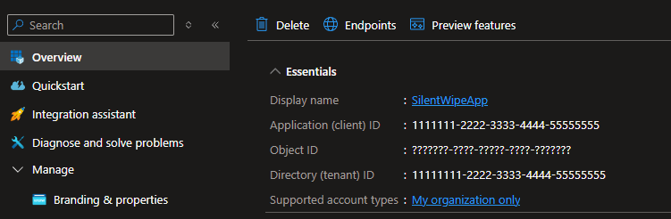

---

Next, configure authentication for your app. Go to the **Authentication** tab and click **Add a platform**.

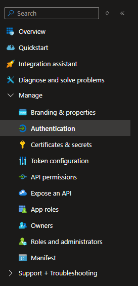

Choose the appropriate platform for your application (e.g., Web, Mobile, Desktop).

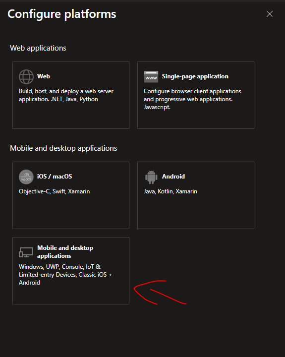

After selecting a platform, configure the redirect URI.

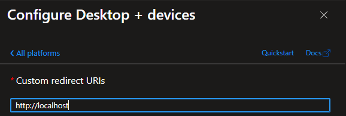

## 3. Configure API Permissions

### For SharePoint

Go to the **API permissions** tab and click **Add a permission**.

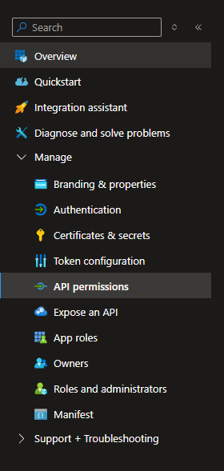

Select **SharePoint** from the list of available APIs.

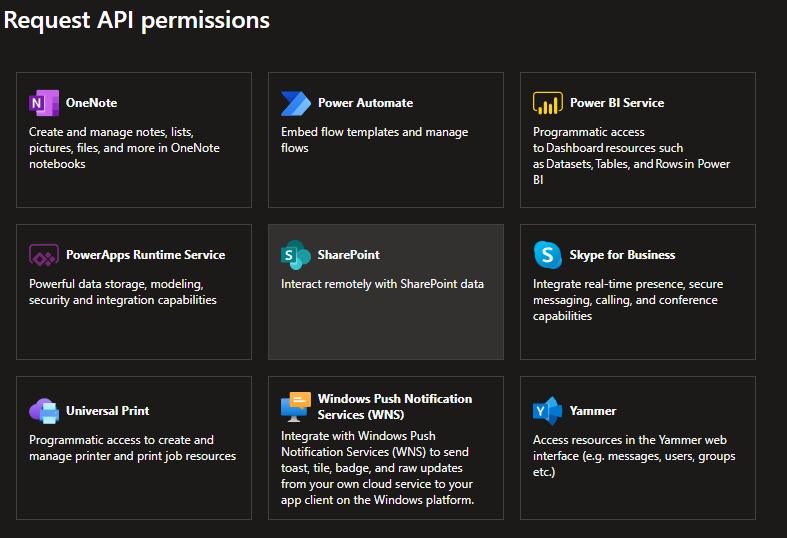

Choose **Delegated permissions** and select the required permissions for your app (e.g., `AllSites.FullControl`).

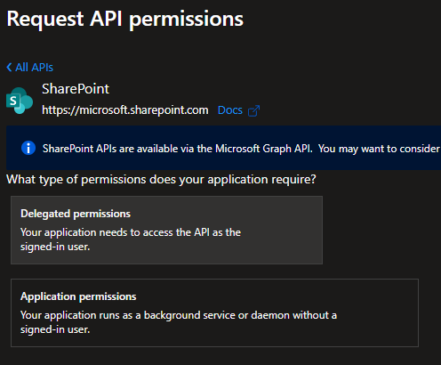

Review the list of selected SharePoint permissions.

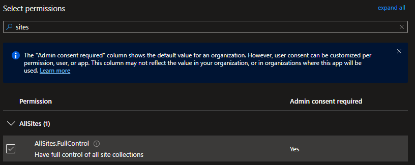

### For Microsoft Graph

Similarly, add permissions for Microsoft Graph.

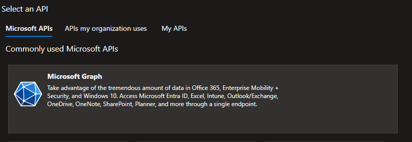

Choose **Delegated permissions** and select the necessary permissions (e.g. `User.ReadWrite.All`).

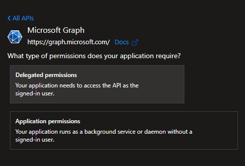

Review the list of assigned Microsoft Graph permissions.

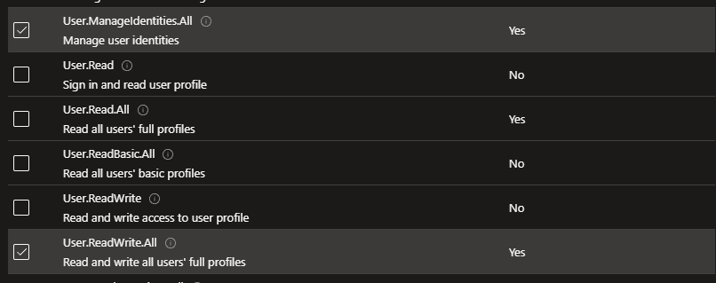


## 4. Grant Admin Consent

After configuring permissions, click **Grant admin consent** to approve the permissions for your organization.

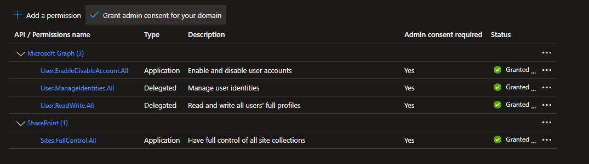

Remove any unnecessary permissions to keep your app secure.

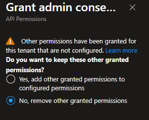

## 5. Generate a Certificate

To enable secure authentication, generate a self-signed certificate using PowerShell. Open PowerShell and run the following commands:

```powershell
# Generate a self-signed certificate
$cert = New-SelfSignedCertificate `
    -Subject "CN=MyAppCert" `
    -CertStoreLocation "Cert:\CurrentUser\My" `
    -KeyExportPolicy Exportable `
    -KeySpec Signature `
    -KeyLength 2048 `
    -Provider "Microsoft Enhanced Cryptographic Provider v1.0" `
    -NotAfter (Get-Date).AddYears(2)

# Export the public certificate (.cer)
Export-Certificate -Cert $cert -FilePath "C:\Path\To\YourAppName.cer"
```

This will create a certificate in your user certificate store and export the public part to a `.cer` file.

## 6. Add Certificate to App Registration

In your app registration, go to **Certificates & secrets**. Click **Upload certificate** and select your `.cer` file. After upload, note the **Thumbprint** value, which will be used for authentication.

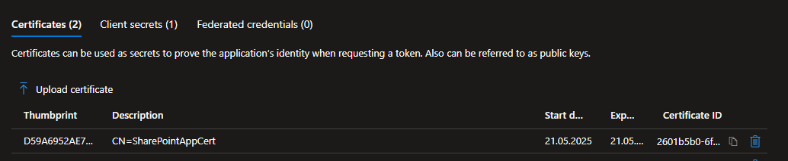

## 7. Copy the Data You Will Use in PowerShell

Make sure to copy and securely store the following values for use in your PowerShell scripts:

- **Thumbprint** (from the uploaded certificate)
- **Client ID** (from the app registration overview)
- **Tenant ID** (from the app registration overview)

---

**References:**

- [Microsoft: Register an application](https://learn.microsoft.com/en-us/azure/active-directory/develop/quickstart-register-app)
- [Microsoft: Certificates for authentication](https://learn.microsoft.com/en-us/azure/active-directory/develop/howto-create-service-principal-portal)


