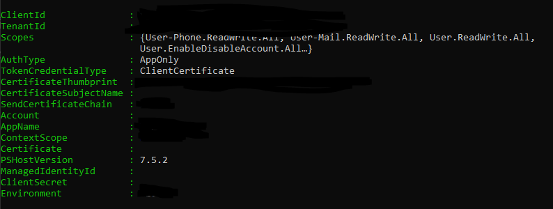

# Microsoft Graph PowerShell Setup Guide

## Prerequisites

- PowerShell 7.2 or later
- Admin privileges to install modules
- Certificate-based authentication set up in Azure (see [Azure/README.md](../Azure/README.md))

## Installation

Install the latest Microsoft Graph Users module:

```powershell
Install-Module Microsoft.Graph.Users -Scope AllUsers
```

## Authentication Setup

Set your authentication variables:

```powershell
$certThumbprint = "your-certificate-thumbprint"
$tenantId       = "your-tenant-id"
$clientId       = "your-app-client-id"
```

Connect to Microsoft Graph using certificate authentication:

```powershell
Connect-MgGraph -ClientId $clientId -TenantId $tenantId -CertificateThumbprint $certThumbprint
```

## Verify Connection

Check your current Graph context:

```powershell
Get-MgContext
```



*The screenshot above displays a PowerShell terminal after successfully connecting to Microsoft Graph. The output confirms the active account, tenant, and scopes, indicating that authentication was completed and the session is ready for further Graph operations.*
