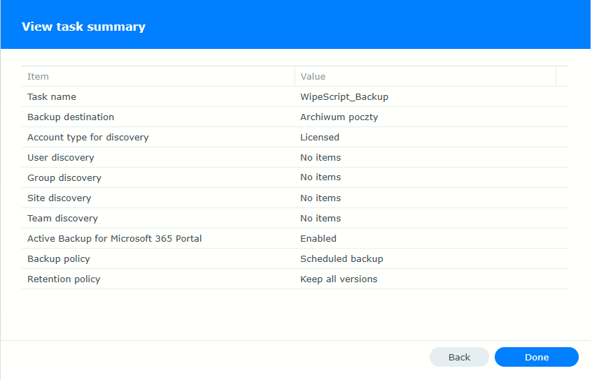

## NAS configuration

To set up automatic backup of group email accounts, follow these steps. My version of NAS is shown in the photo below:

## 

Go to the package center and select Active Backup for Microsoft 365. If it is not installed, please do so.

## 

Go to the application, select the task list, and select a new task to create a backup.

## 

Name the backup with your own name, then search for the group you created in the domain, select it, and if necessary, activate Active Backup for Microsoft 365 Portal. Selecting this option allows users without admin privileges to independently restore or export their data from the backup in the Active Backup for Microsoft 365 portal.

---

Select create a backup task to connect the backup application to your domain and generate an application certificate.

---

After entering the certificate password and continuing, you should be prompted to log in to 365 and asked to grant permissions to NAS. Accept, and the application will be registered in your domain as trusted.

## 

Don't select anything here. We only need a backup of this one group, nothing else.

## 

Set the scheduler to perform a backup every Monday, the script runs every month, or the setting can be changed, so there is no need to perform backups every day.

## 

This is what the finished backup looks like.

