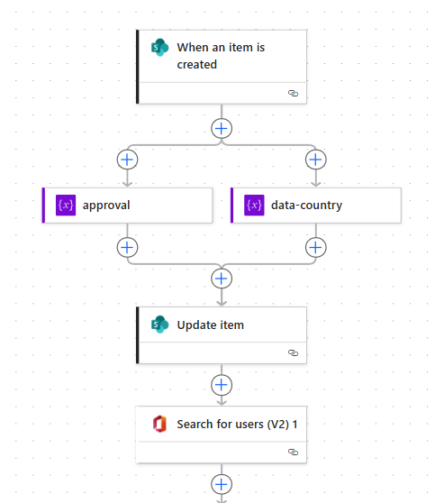
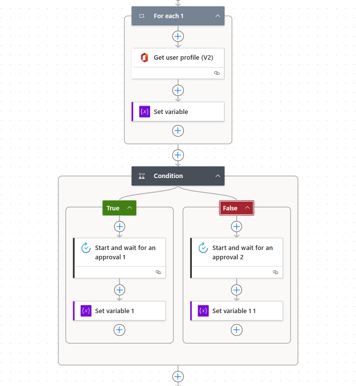
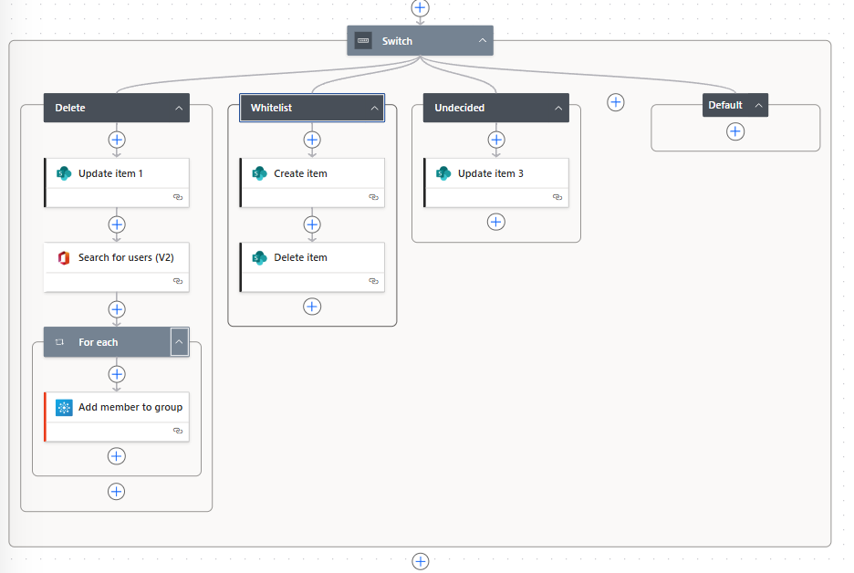

## How to Configure a flow with SilentWipeScript

### Flow Overview

1. **Trigger:** The flow starts when a new item is created in the SharePoint "Users" list.
2. **Initialize Variables:**  
    - One variable stores the approval result (since the process is split into two parts).
    - Another variable stores the user country.
3. **Update Item - column status:** Set the record status to "awaiting approval".
4. **Search for User:** Use "Search for users V2" to find the user by email.

5. **Get User Profile:**  
    - Use "Get user profile V2" inside a "For each" loop (even if there is only one user).
    - Retrieve the country from the user profile and store it in the variable.
6. **Conditional Approval:**  
    - If the user country is not "HQ", send the approval request to a different HR person.
7. **Store Approval Result:**  
    - The variable always holds the latest approval result for use in the next step in switch.
    

8. **Switch Based on Approval:**  
    - After the HR decision, use a "Switch" action to handle the result:
      - **Delete:** Add the user to the "backup" and remove the record from the "Users" list.
      - **Whitelist:** Add the user to the whitelist and remove the record from the "Users" list.
      - **Undecided:** Remove the record from the "Users" list.

