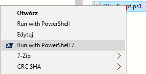

## PowerShell – Installation

This project requires **PowerShell 7 (pwsh)**

**You can download the latest version here:**

[Download Powershell 7.5.2](https://learn.microsoft.com/en-us/powershell/scripting/install/installing-powershell-on-windows?view=powershell-7.5#installing-the-msi-package)


## Script – Files Description
 - **file name**: [*SilentWipeLauncher.ps1*](SilentWipeLauncher.ps1)

This file silently launches a PowerShell script (SilentWipeScript.ps1) using PowerShell 7 (pwsh.exe). It runs the script with no profile, bypasses the execution policy, and hides the window during execution.


 - **file name**: [*SilentWipeScript.ps1*](SilentWipeScript.ps1)

 This file is the main PowerShell script of the project, responsible for automation logic. It integrates multiple technologies — Active Directory, Microsoft Graph, and SharePoint (via PnP PowerShell) — to manage inactive users across the environment and keep data in sync.

 ## First Run:


Before running the script for the first time, make sure the following requirements are met:

- **Active Directory** (on-prem or Azure AD) is configured and accessible  
- **PowerShell 7** is installed and available as `pwsh`
- **App Registration** is set up in Entra ID (Azure AD), with:
  - `Client ID`
  - `Tenant ID`
  - `Certificate Thumbprint`  
  The certificate must be installed on the local machine (`LocalMachine\My`)
- A **SharePoint Online site** is created with the following lists:
  - `Users` — must include at least the columns: `email`, `status`
  - `Whitelist` — must include the column: `email`
  - `Logs` — must include the column: `log`
- The machine has **network access** to:
  - `graph.microsoft.com`
  - `yourtenant.sharepoint.com`
  - **Domain Controller** (for Active Directory operations)
- You have replaced all **placeholders** in the script with real values:

```plaintext
your_cert_thumbprint_here
your_tenant_id_here
your_client_id_here
https://yourtenant.sharepoint.com/sites/your-site
your-domain.com
 ```

---
 Once all requirements are fulfilled, you can manually test the script by running it in PowerShell 7:

```powershell
pwsh -NoProfile -ExecutionPolicy Bypass -File "your_path_to\SilentWipeScript.ps1"
```

You can also run the script by right-clicking the `.ps1` file and selecting:

 


 ## Task Scheduler Setup

 To run the script automatically, you need to create a scheduled task using the snippet below:
 ```powershell
 # Path to the main script
$scriptPath = "your_path_to\SilentWipeScript.ps1"

# Get path to pwsh.exe
$pwshPath = (Get-Command pwsh).Source

# Start time 
$hour = 6
$minute = 0
$time = "{0:D2}:{1:D2}" -f $hour, $minute

# Create the scheduled task
schtasks /Create /TN SilentWipe_Monthly `
    /TR "`"$pwshPath`" -NoProfile -ExecutionPolicy Bypass -File `"$scriptPath`"" `
    /SC MONTHLY /D 1 /ST $time /RL HIGHEST /F

# Run the task once immediately after setup for testing purposes
schtasks /Run /TN SilentWipe_Monthly
```
