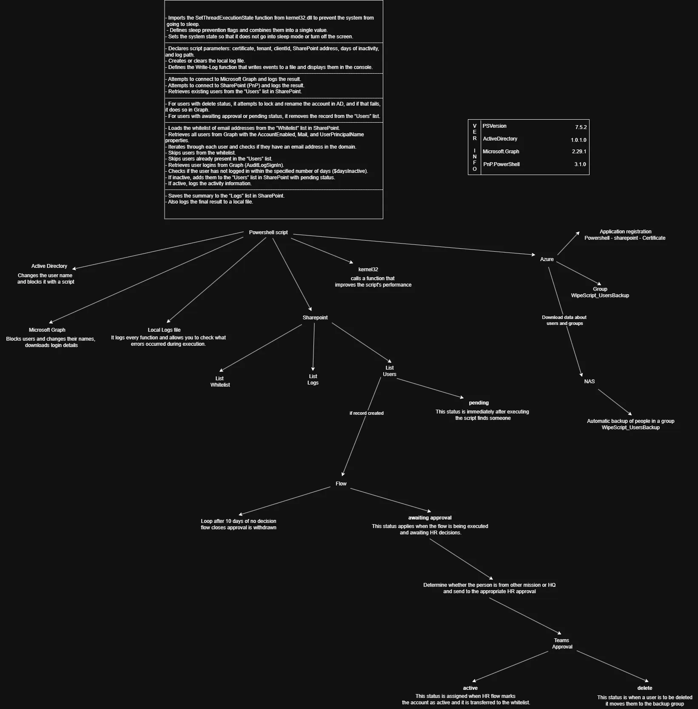

# SilentWipeScript

**SilentWipeScript** is a PowerShell script that automates the detection and handling of inactive employee accounts.  
Its main purpose is to reduce the workload of IT and HR departments by monitoring user logins and flagging accounts accordingly.  
Inactive accounts are automatically transferred to SharePoint and await HR decision, while SharePoint lists provide both departments with a clear overview of account status.  
This streamlines offboarding processes, increases security, and reduces manual administrative work.

The script combines several technologies:

- **Microsoft Graph** – retrieves user details, sign-in information, and applies account updates
- **SharePoint (PnP)** – acts as the central storage for lists, logs, reporting, and workflow support
- **Active Directory** – used for disabling and renaming accounts in the local domain
- **NAS & Mail Backup** – integrates with organizational storage and mail archiving for data protection and retention
- **PowerShell** – provides the automation engine and logic that connects all systems together
- **Azure** – used for identity management, cloud integration, and running services in a secure environment
- **Power Automate** – can extend workflows with notifications, approvals, or further automation steps

In this way, SilentWipeScript integrates multiple systems into a single, automated tool that supports both IT administration and HR processes.

---

## 

## Process Overview

1. Prevents system sleep during execution to ensure uninterrupted operation.
2. Connects to Microsoft Graph and SharePoint.
3. Retrieves existing user records and whitelist data from SharePoint.
4. Identifies inactive accounts based on login history and inactivity period.
5. Takes appropriate action:
   - Blocks and renames accounts in AD or Graph after approvals are accepted by HR
   - Adds new inactive users to SharePoint for verification
   - Deletes outdated entries from SharePoint
6. Saves logs both locally and in SharePoint for reporting and auditing.

# Azure Configuration

Below you will find step-by-step instructions for creating a certificate, registering an application in Microsoft Entra ID, and assigning the required Microsoft Graph and SharePoint permissions. This is necessary for the script to perform tasks using Graph and change, delete, or create something on SharePoint.

[Go to Azure configuration](Azure/README.md)

_Remember to copy from this guide the **tenant ID**, **client ID**, and **certificate thumbprint** for proper connection to PowerShell._

# NAS Configuration

Below you will find step-by-step instructions for configuring backup on NAS. NAS is used for the security of mailboxes in case they are deleted, so that we are able to restore the mail of such a person.

[Go to NAS configuration](NAS/README.md)

_Remember to make sure beforehand that the Azure group has been created so that it can be selected._

# Microsoft Graph Configuration

To enable SilentWipeScript to interact with Microsoft 365 accounts, you need to configure the Microsoft Graph PowerShell module. This allows the script to retrieve user login data and manage accounts securely.

[Go to Graph configuration](Graph/README.md)

---

### Plan

1. ~~Description of what it is used for + presentation of how it works~~
2. Powershell, script configuration + task scheduler
3. ~~Microsoft Graph - connection with Powershell~~
4. Sharepoint site and list configuration + connection with Powershell
5. Active Directory - connection with Powershell
6. Logs – log descriptions
7. Power Automate – connection to SharePoint + Azure
8. ~~NAS backup – configuration of automatic backup for users in the group~~
9. ~~Azure - creating a group + registering a SharePoint application for PowerShell~~
10. Possible paths for further development
