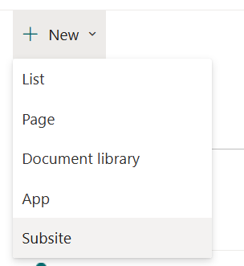
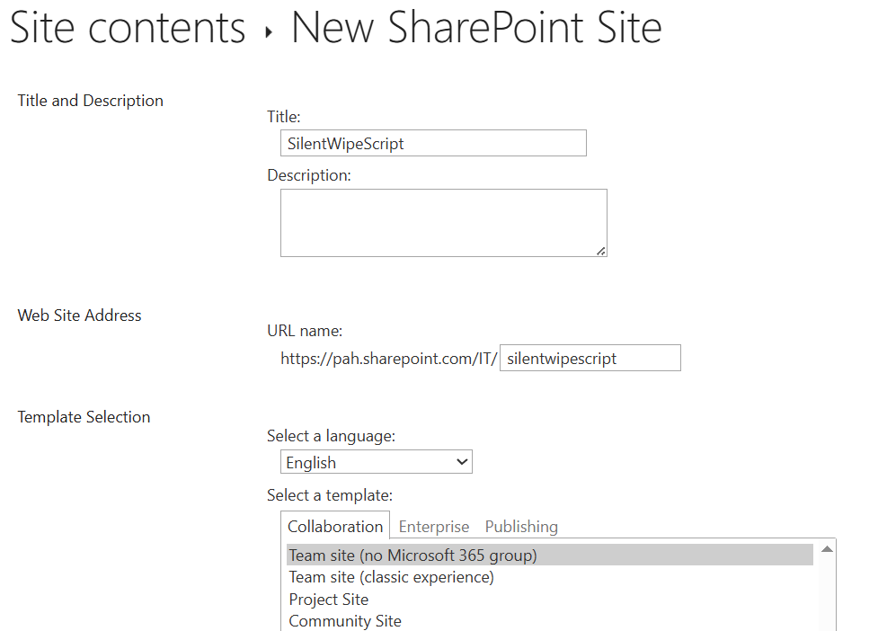
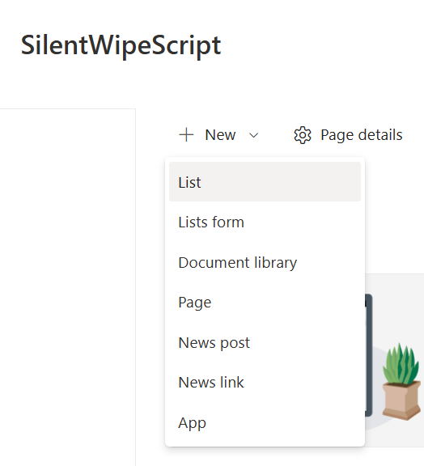
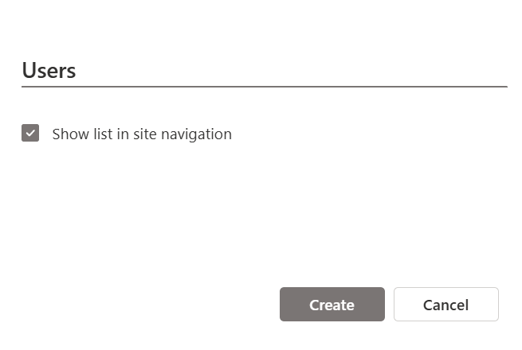
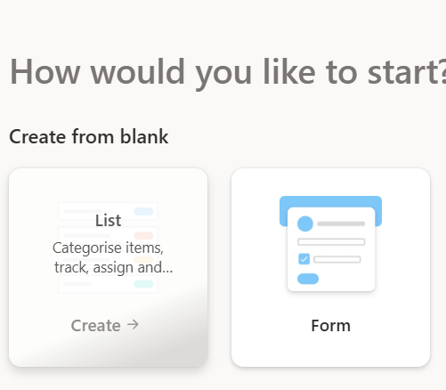
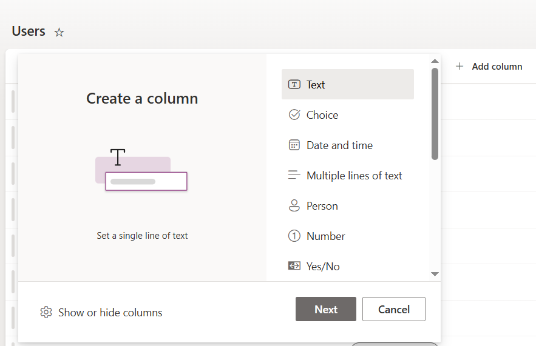

# Sharepoint Configuration + Connection to Powershell

## Creating a SharePoint Subsite

To begin, create a new SharePoint subsite where you will manage your lists.  
  
After clicking to create a new subsite, enter a name and description. 


## Creating Lists

Next, create the necessary SharePoint lists **Whitelist**, **Users** and **Logs**.  
  
  
Choose "Start from blank" to customize the list structure.  
  
Add columns to the list to capture all required information, such as emails, status look bellow

| List Name | Columns       |
| --------- | ------------- |
| Users     | email, status |
| Whitelist | email         |
| Logs      | log           |



## Connecting Sharepoint in Powershell with a Certificate Azure (Entra ID)

To securely connect your SharePoint site with external application build in powershell, set up certificate-based authentication in Azure (Entra ID).

You can find a detailed example of configuring Entra ID and certificate-based authentication in this readme:
[How to configure connection between sharepoint - powershell](../Azure/README.md#2-create-a-new-app-registration)

This process involves:

- Registering an application in Azure Entra ID
- Uploading a certificate for authentication
- Granting the necessary API permissions to the app

## Test connection

To test your SharePoint connection with certificate-based authentication in PowerShell, use the [PnP.PowerShell](https://pnp.github.io/powershell/articles/installation.html) module:

```powershell
Connect-PnPOnline -ClientId "<app-client-id>" -Url "https://<tenant>.sharepoint.com/sites/<site>" -Tenant "<tenant>.onmicrosoft.com" -Thumbprint "<cert-thumbprint>"

# Example: check current user
Get-PnPUser -LoginName "<your-user-email>"
```

If successful, you are connected and can interact with SharePoint.
